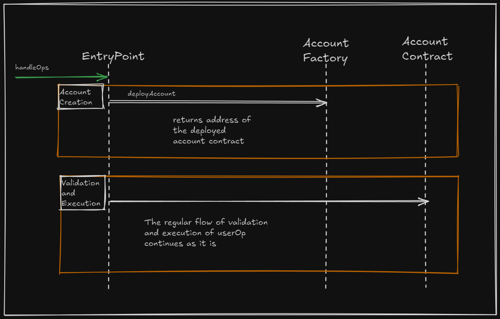

# Account Factory (ERC4337)

This project implements an Account Factory for the [Simple Account](https://github.com/nikbhintade/erc4337-simple-account) built earlier. It works with `EntryPoint` to deploy new accounts for users.  

## Features  
- **Deterministic Deployment:** Uses `CREATE2` for predictable addresses (per ERC-4337).  
- **Full Test Coverage:** Ensures all key functionality is tested.  

## Installation  

Make sure Foundry is installed on your system. If not, check Foundry's documentation for installation steps.

Clone the repo:  
```bash
git clone git@github.com:nikbhintade/account-factory.git
cd account-factory
```  

Install dependencies:  
```bash
forge install
```  

Build the project:  
```bash
forge build
```  

Run tests:  
```bash
forge test -vvvv
```  

## Contract Overview  

The factory deploys Simple Account instances. The `deployAccount` function takes:  
- `IEntryPoint` instance  
- Owner address  
- `bytes32 salt` for deterministic deployment  

It passes the first two to the account contract’s constructor, while `salt` passed to `Create2.deploy` function for deterministic deployment.  

The `getAddress` function allows to get the account address without deploying it. Since ERC-4337 requires the sender's address when submitting user operations, this makes sure there are no errors during contract creation.  

## How It Works  

For a complete flow, check the `EntryPoint` contract. If the userOp sender (account contract) doesn’t exist and `initCode` is not empty, `EntryPoint` calls the factory to deploy the account before continuing with validation and execution.  

  

## Contributions  

Suggestions and contributions are welcome! Feel free to share feedback.